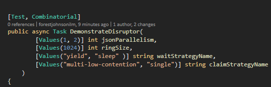

## disruptor-stream-csharp

An example of the Disruptor C# implementation which processes a stream of updates to Todo Lists and sends them to an imaginary external service.

### Dependency on NUnit 3 test adapter
To test the project on your machine, install the NUnit 3 test adapter via Tools -> Extensions and Updates in Visual Studio. Then run the tests. It will try all different configuration combinations and report a ranked list to the test-ouput.



On my laptop, the highest throughput was with large objects, a ring with 512 elements, 4 JSON threads, using the sleeping wait strategy and the low-contention multi-threaded claim strategy. It processed 89 Megabytes per second. 

```
Took: 236 ms to process 1500 updates 
at a rate of 89 megabytes per second 


rate of 89 MB/s with jsonParallelism: 4, ringSize: 512, maxNumberOfItemsPerList: 80, 
rate of 85 MB/s with jsonParallelism: 4, ringSize: 1024, maxNumberOfItemsPerList: 80, 
rate of 76 MB/s with jsonParallelism: 2, ringSize: 512, maxNumberOfItemsPerList: 80, 
rate of 72 MB/s with jsonParallelism: 2, ringSize: 1024, maxNumberOfItemsPerList: 80, 
rate of 58 MB/s with jsonParallelism: 1, ringSize: 512, maxNumberOfItemsPerList: 80, 
rate of 50 MB/s with jsonParallelism: 1, ringSize: 1024, maxNumberOfItemsPerList: 80, 
rate of 32 MB/s with jsonParallelism: 2, ringSize: 512, maxNumberOfItemsPerList: 10, 
rate of 32 MB/s with jsonParallelism: 4, ringSize: 512, maxNumberOfItemsPerList: 10, 
rate of 27 MB/s with jsonParallelism: 1, ringSize: 512, maxNumberOfItemsPerList: 10, 
rate of 26 MB/s with jsonParallelism: 4, ringSize: 1024, maxNumberOfItemsPerList: 10,


```
